# 烟火app 2.0

    

   烟火app，一个基于微服务架构的前后端分离项目

<a target="_blank" href="https://gitee.com/moxi159753/mogu_blog_v2">
    	</img>
		</img>
        </img>
        </img>
        </img>
        </img>
        </img>
        </img>
</a>

[项目介绍](#项目介绍) | [运行配置](#运行配置) | [测试账号](#测试账号) | [项目技术](#项目特点及功能) | [技术选型](#技术选型) |  [关注&交流](#关注&交流) | [赞赏](#赞赏) | [项目截图](#项目截图)

## 项目介绍
### **3.0版本开发中…，将要优化的部分介绍**
- 数据库重构，代码结构优化
- 重做点赞，收藏，评论模块，目前点赞收藏数据主要存在数据库中，性能较差。后续将数据存放在redis中，优化点赞，收藏，评论模块。定时同步数据，使用mq做异步通知。
- 解决redis和mysql数据一致性问题
- es搜索功能重做
- 关注动态功能重做。用户发布新的图片要通知他的粉丝关注动态更新，并按照发布时间排序
- 前端ui优化

#### **2.0版本发布，优化数据库和优化代码结构**

**需要旧版本请切换分支**

烟火app一个**基于微服务架构的前后端分离系统**。**Web** 端使用 **Vue** + **ElementUi** , 移动端使用 **uniapp** 和 **ThorUI**。后端使用 **SpringCloud** + **SpringBoot** + **Mybatis-plus**进行开发，使用 **ElasticSearch**  作为全文检索服务，使用**webSocket**做聊天和消息推送，文件支持**七牛云**和**阿里云上传**.并支持本地**QQ**,**微信**和**微博**登录。

- 烟火app完整项目均是由自己一个开发完成，主要是想学习一下uniapp技术和积累一些项目经验，因此项目中可能会有一些bug，欢迎大家加我qq或微信联系。
- 推荐功能需要一个压缩模型，无法上传，需要加我qq。如果不使用推荐功能也可以运行。里面也有使用协同过滤算法做推荐功能
- 如果对uniapp项目不熟悉，本地仓库中还有一个只使用vue技术实现的一个完整的前后端分离的视频播放器项目。项目地址https://gitee.com/xzjsccz/cc_video

【联系我】已入职国企，没有太多时间再来做这个项目了，也没有时间帮忙解决问题，大家加群吧讨论吧  
**QQ** 879599115

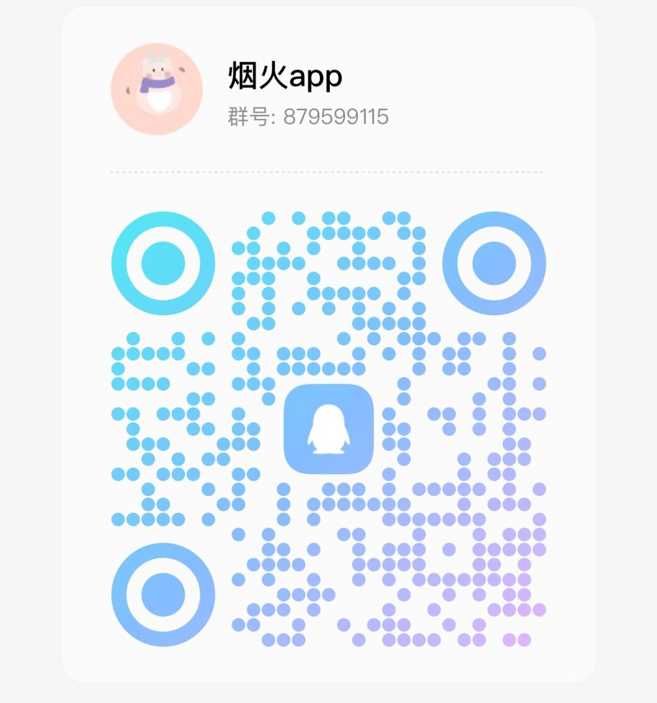 

## 运行启动

数据库在`doc`包中。`yanhuo.sql`

### 项目启动

**手机端运行**

进入 http://ccimgvideo.top:53550/  直接下载apk测试文件运行即可

**web端运行**

下载项目，将`yanhuo-uniapp`直接导入到hbuilder即可正常运行

### 本地运行

**前端启动**

下载项目进入`yanhuo-uniapp`中，修改`config`包下的配置文件

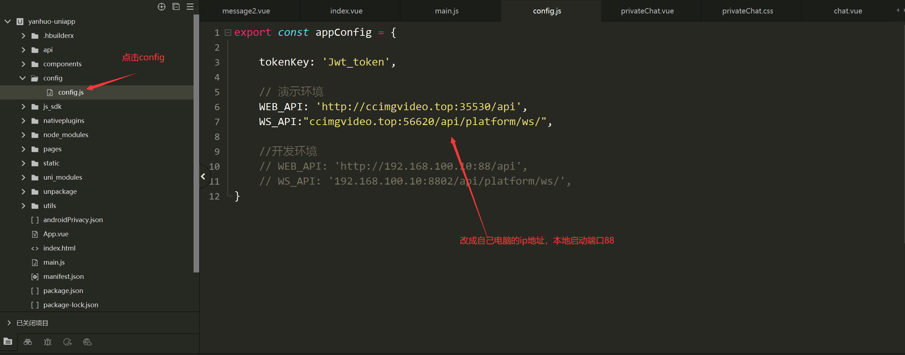

如果要使用聊天功能则需要修改`main.js`下的配置文件，将`appkey`改成自己在`goeasy`注册的`commonKey`(**goeasy网址:https://console.goeasy.io/**)

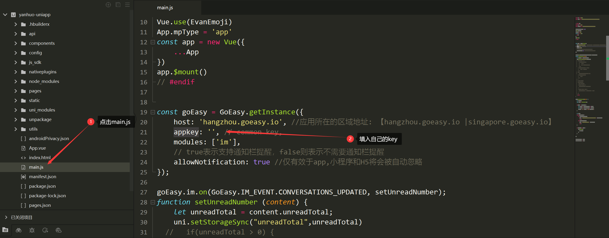

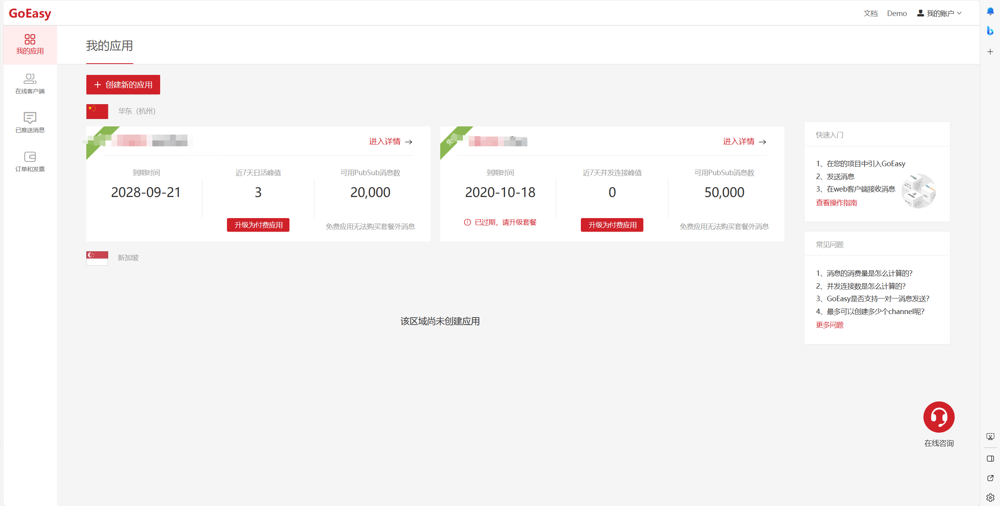

配置好后启动即可

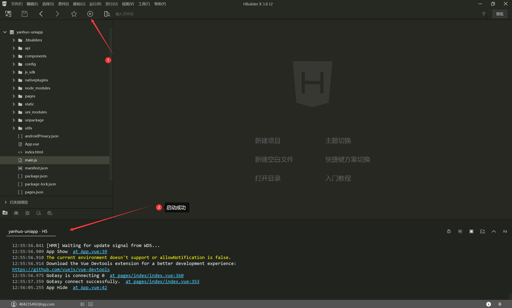

**后端启动**

- 首先需要把`redis`，`elasticsearch`,`nacos`，`rabbitmq`环境配置好并启动。

- 修改`yanhuo-common`,`yanhuo-auth`,`yanhuo-gateway`,`yanhuo-search`,`yanhuo-platform`,`yanhuo-recommend`下的配置文件，并启动`yanhuo-auth`,`yanhuo-gateway`,`yanhuo-search`,`yanhuo-platform`这四个服务就可以正常浏览项目。(!!!**启动platform模块之前，必须先启动search模块，否则platform模块不会启动成功**)

  **yanhuo-common**`->`**application.yml**

  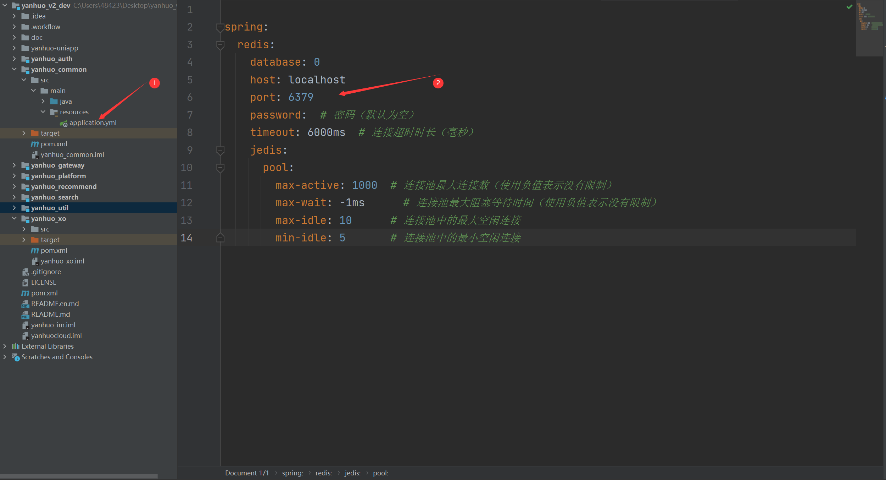

  **yanhuo-platform**`->`**application-dev.yml**

  

- 如果需要使用图片上传,短信，邮箱,搜索功能，需在`yanhuo-util`模块中连接自己的`oss`账号。

  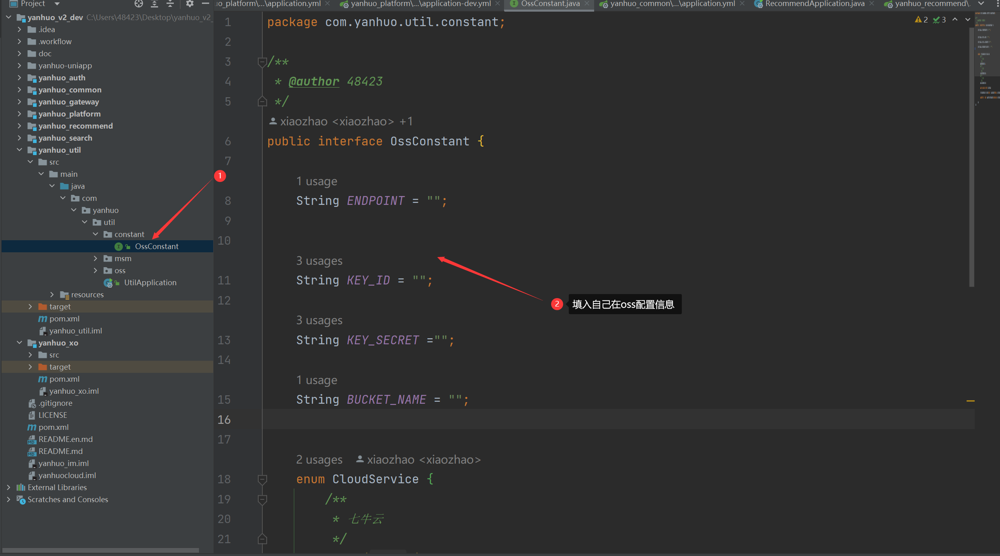

- 启动项目

  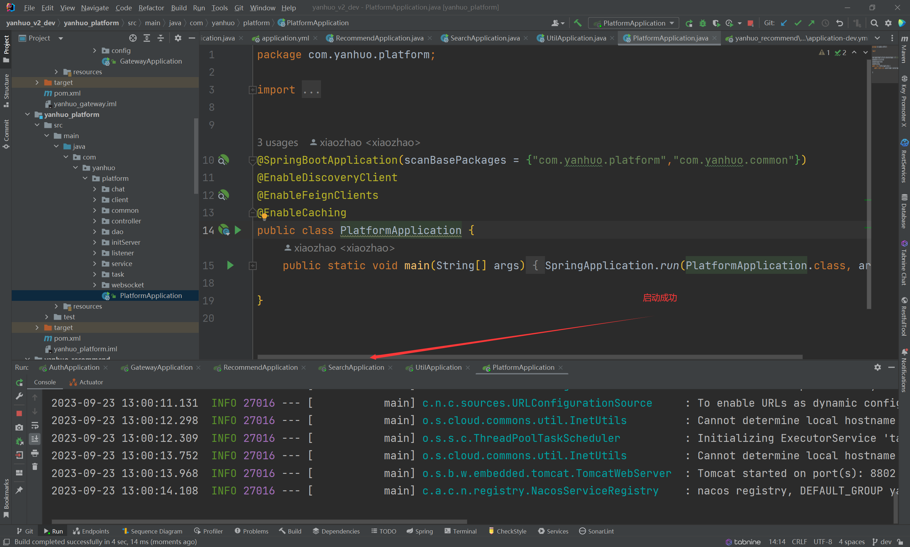

### 成功运行

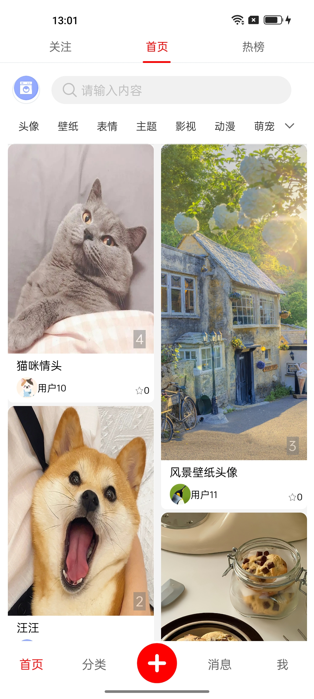

## 测试账号

**app下载地址**:http://ccimgvideo.top:53550/

**仓库中有apk测试文件**(第三方登录只能在本地登录，因为没有企业认证，所以发行版本无法第三方登录。大家使用下面的测试账号密码登录即可)，欢迎大家下载测试。当然也可以导入项目以后只在hbuilder中启动yanhuo-uniapp也是可以正常浏览项目。

烟火app测试账号 xiaozhao \
烟火app测试密码 123456

烟火app测试账号 qwer \
烟火app测试密码 123456

烟火app测试账号 qwer1234 \
烟火app测试密码 123456

## 后期维护

项目移动端基本所有功能都做完，后期准备把后台管理平台完成。。。

## 项目特点及功能

- 使用springboot+mybatis_plus+vue+uniapp框架
- 采用 Nacos 作为服务发现和配置中心
- 使用gateway做网关过滤，对发送的请求做过滤。（部分请求放行，比如登录请求，首页数据请求）
- 支持七牛云对象存储和阿里云oss对象存储。
- 采用自定义参数校验注解，轻松实现后端参数校验
- 使用推荐算法做首页推荐功能（使用协同过滤算法及结合simhash和海明距离共同做推荐功能，新版本使用机器学习算法做推荐功能。
- 支持三方登录功能（支持qq，微信，微博登录）也可以手机号验证登录
- 使用ElasticSearch做搜索功能
- 使用websocket做私信聊天和实时通知
- 使用redis做对象缓存
- 采用uniapp 和ThorUi 完成烟火app的移动端门户页面搭建

## 项目地址

目前项目托管在 **Gitee** 和 **Github** 平台上中，欢迎大家 **Star** 和 **Fork** 支持~

- Gitee地址：https://gitee.com/xzjsccz/springboot-vue-ccimgcloud
- Github地址：https://github.com/xiaozhao-66/ccimgcloud-springboot-vue （github是旧版本）

## 项目目录

- yanhuo-admin-vue 后台管理页面
- yanhuo-uniapp 移动端页面
- yanhuo-admin 后台管理服务
- yanhuo-auth 认证服务
- yanhuo-common 公共模块,存放一些工具类或公用类
- yanhuo-platform 烟火app主要功能模块
- yanhuo-recommend 推荐系统模块
- yanhuo-search 搜索模块
- yanhuo-util  第三方服务模块，邮箱短信，oss对象存储服务
- yanhuo-xo  对象存放模块

## 技术选型

### 后端技术

|      技术      |           版本           |      
| :------------: | :-----------------------: 
|   SpringBoot   |         2.3.2.RELEASE      |  
|  SpringCloudAlibaba	   |        Hoxton.SR6    |   
| Shiro |      1.10.0       |  
|  MyBatis-Plus  |              -        |          
| Elasticsearch  |         7.16.3       |   
|     Redis      |        4.2.2         |  
|     Druid      |              |  
|     oss对象存储     |     -     |            
|      JWT       |        0.7.0        |                
|     Lombok     |     -      |
|     Nginx      |  1.12.2  |         
|     Hutool     |      -       |               
|   websocket    |     2.3.2.RELEASE      |   

### 前端技术

|      技术      |           版本           |      
| :------------: | :-----------------------: 
|   nodejs	   |         12.14.0（最好一致）    |  
|  vue		   |    -     |   
|  uniapp	  |              -        |          
| vueX	  |        -      |   
|    axios	      |      -       |  
|     其他组件      |    -          |  

## 关注&交流

一个仿照小红书设计的浏览图片uniapp项目,有问题加q3044606584或者q484235492，微信 18572755162

## 赞赏
因为博主还没有正式毕业所以服务器和其他需要费用的服务管理都比较差，因此为了正常维持这个项目，如果有小伙伴需要我帮忙部署项目，可能需要收取一定的费用
。

## 项目截图

|                        移动端                         |                                                       |
| :----------------------------------------------------: | :---------------------------------------------------: |
|      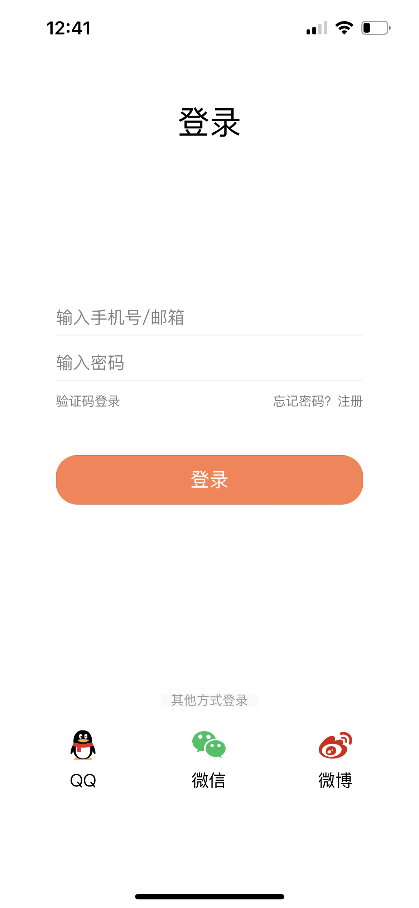       |        |
|        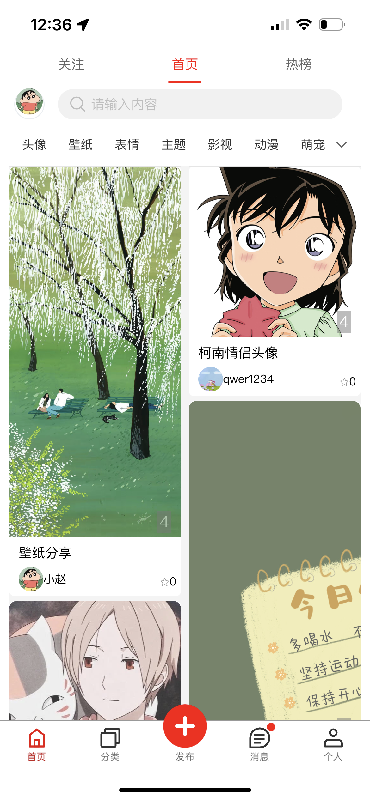       |    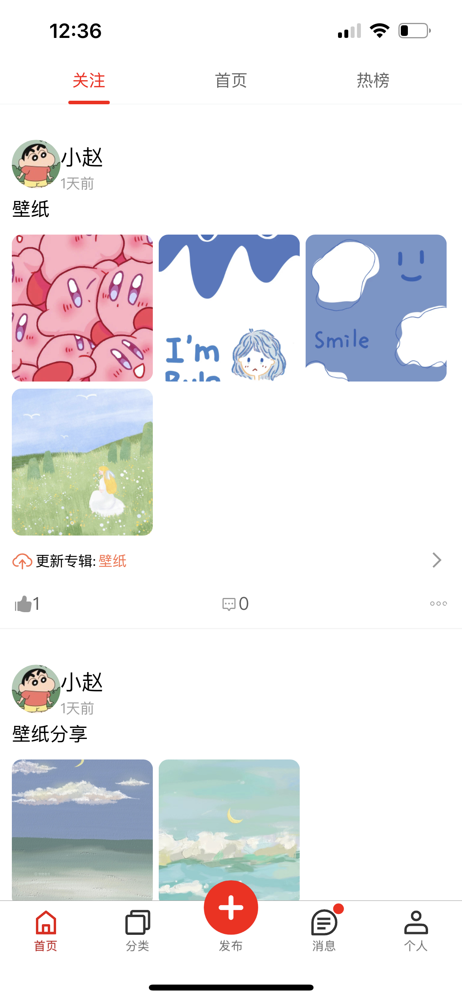     |
|    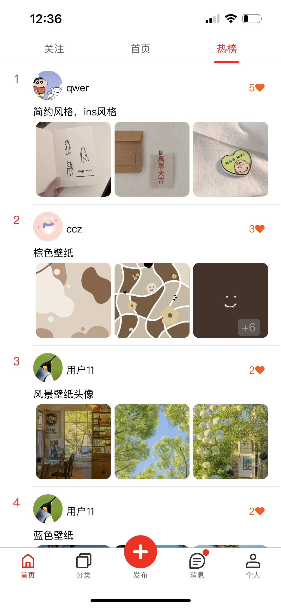    |           |
|            |      |
|            |    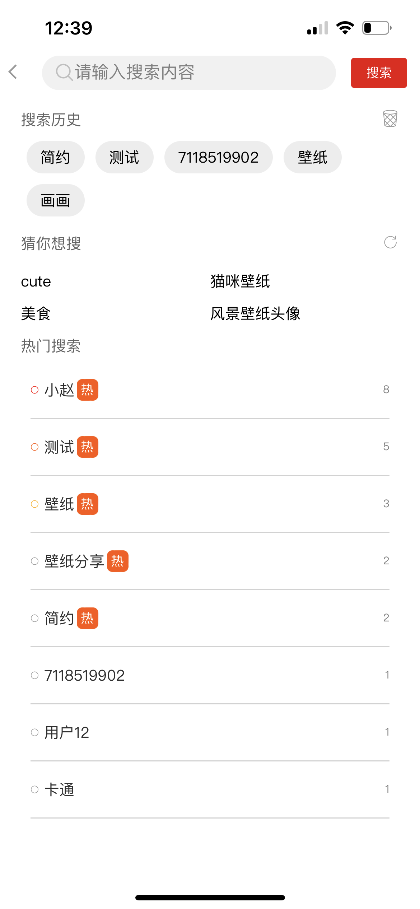     |
|      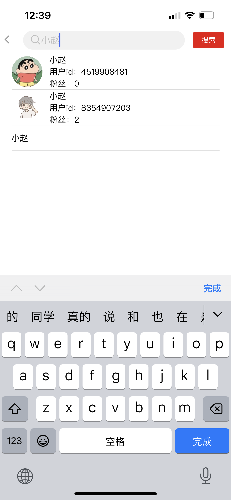      |               |
|            |       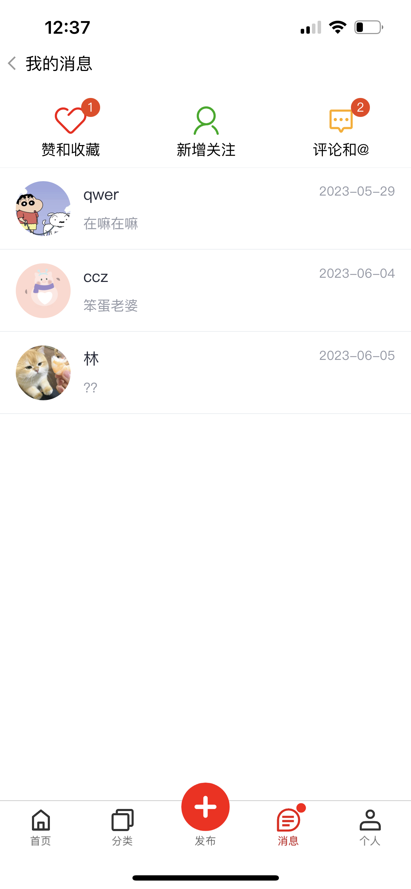       |
|            |      |
|                                                        |                                                       |
|      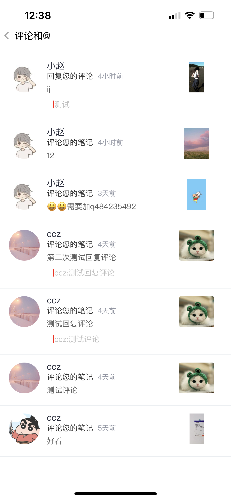      |    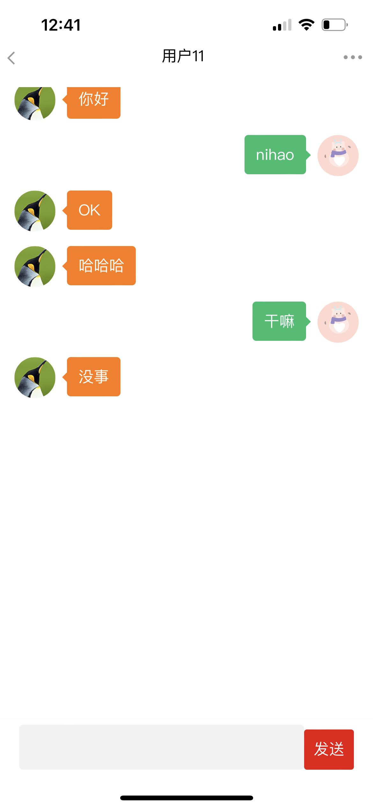    |
|      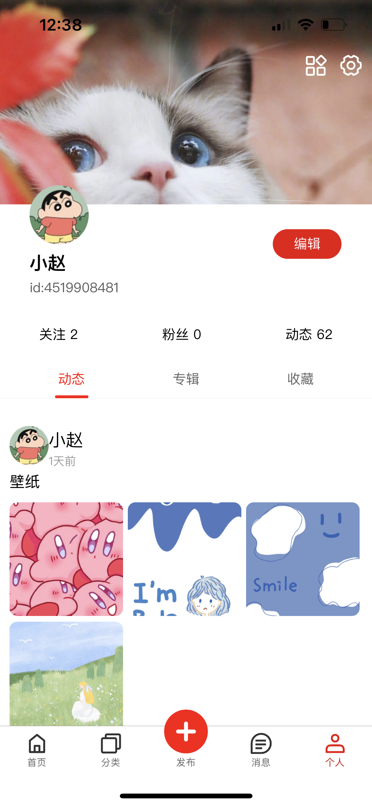      |          |
|            |  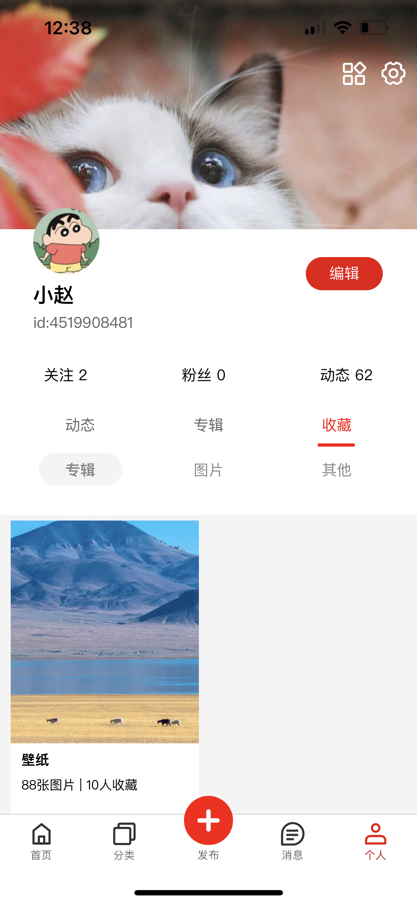   |
|                                                        |                                                       |
|   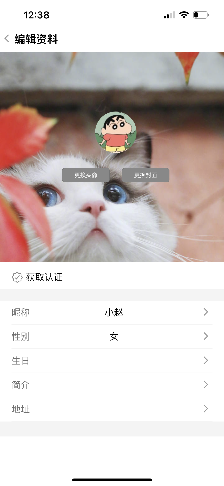    |   |
|   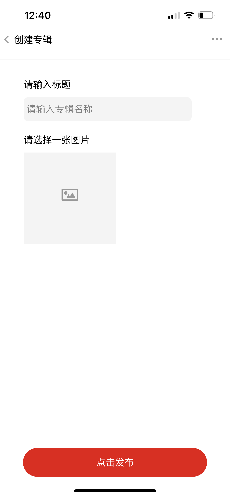    |   |
|   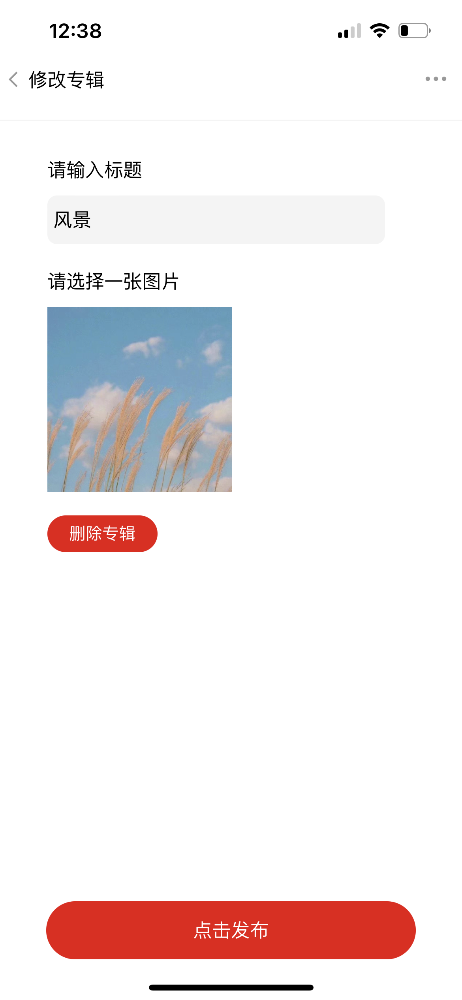    |   |
|       |   |
|   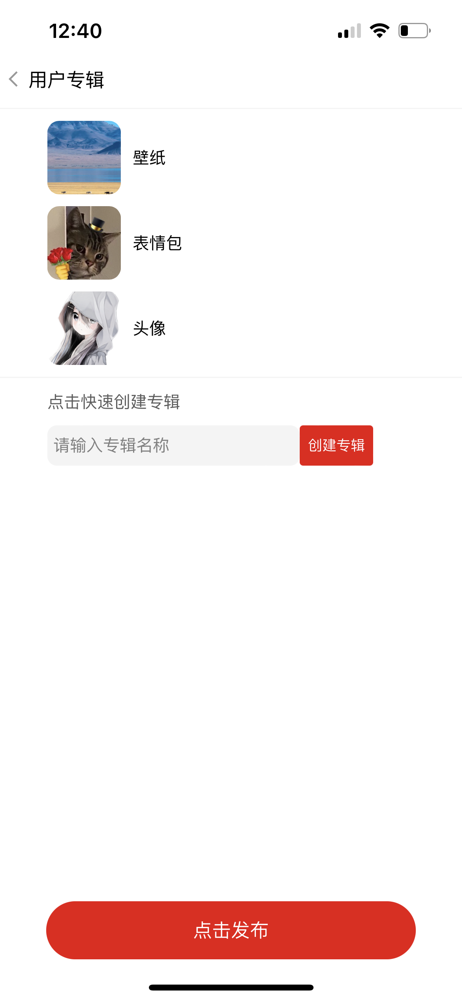    |  |

