# Springboot-vue-ccimgcloud

#### 数据库和apk测试安装包在ccimg-admin-vue下的public包中（！！！项目启动流程在下面）

#### 介绍
一个仿照小红书设计的浏览图片uniapp项目,有问题加q3044606584（小号，可能收不到消息）或者q484235492。（**目前没有开发文档，运行不了（不包括环境配置问题）或者有哪里代码不懂可以加我，都会回复的**）

 第一次学习uniapp因此想做个项目来学习一下，后续可能更新会很慢，如果觉得项目不错可以点个赞，谢谢。

####  项目启动
首先需要把redis，nacos环境配置好并启动。

启动**ccimgcloud-auth**,**ccimgcloud-gateway**,**ccimgcloud-platform**,**ccimgcloud-recommend**这四个服务就可以正常浏览项目。

如果需要使用图片上传和短信，邮箱服务，需要配置es环境并启动，并在ccimgcloud-utils模块中连接自己的oss账号，然后启动**ccimgcloud-search**和**ccimgcloud-utils**(注意配置oss)这两个服务。

如果只需要运行后台页面，则启动**ccimgcloud-admin**和**ccimgcloud-manage**模块即可

#### 文档
等把所有的功能完善后会更新一份文档...。如果有小伙伴想一起完善这个项目也可以加q，目前后端管理员的功能未实现，后续再慢慢做吧，不太想做后端页面。

#### 功能介绍
- 使用springboot+mybatis_plus+vue+uniapp框架
- 图片上传发布（新增上传后可重新编辑功能）
- 图片下载收藏（收藏至专辑或保存到本地相册）
- 使用推荐算法做首页推荐功能（使用协同过滤算法及结合simhash和海明距离共同做推荐功能，主要统计用户浏览记录）
- 第三方登录功能（支持qq，微信，微博登录）也可以手机号验证登录
- 评论跳转回复（支持发送表情）
- 用户关注点赞（可取消收藏点赞）
- 使用es做搜索功能（首页搜索查询）
- 私信聊天，消息发送（左滑可删除聊天）
- 短信邮箱发送（用于验证码验证）
- 使用websocket做实时通知未读计数
- 使用redis做缓存，缓存用户的点击记录（用于做推荐功能）
- 网关过滤，对发送的请求做过滤。（部分请求放行，比如登录请求，首页数据请求）

 !!! 后续将实现更多的功能，也会慢慢的完善bug，因为做得时间很短，所以很多
 代码写的不规范也没有时间去整理。如果有bug可以加q联系我。

####使用技术
| 后端技术     | 版本    |
| --------   | -----:  |
| jdk  | 1.8 |
| maven  | 3.0+ |
| springboot        | 2.3.2.RELEASE      |  
| mysql        | 8.0.21      |  
| redis        | 4.2.2      | 
| springcloudalibaba        | Hoxton.SR6      | 
| nacos        | 2.2.1.RELEASE      |
| openfeign        | 2.2.1.RELEASE       |  
| gateway        | 2.2.3.RELEASE    | 
| mybatis_plus        | 3.5.2     | 
| elasticsearch       | 7.16.3     | 
| websocket        | 2.3.2.RELEASE       |  
| shiro        | 1.10.0      |  
| jwt        | 0.7.0      |
| oss对象存储        |      |
| nginx       | 1.12.2     |

| 前端技术     | 版本    |
| --------   | -----:  |
| nodejs        | 12.14.0（最好一致）      |  
| vue        |      |  
| uniapp        |       | 
| vueX        |       | 
| axios        |       |
| 其他组件（。。。）        |       | 

#### 实现页面
####首页
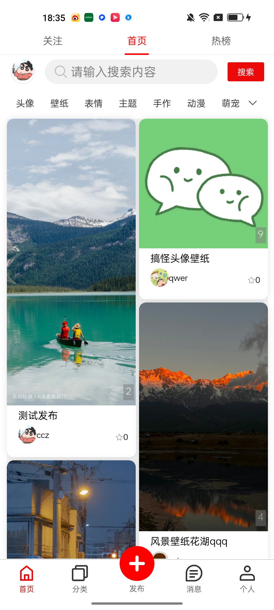
#### 热榜
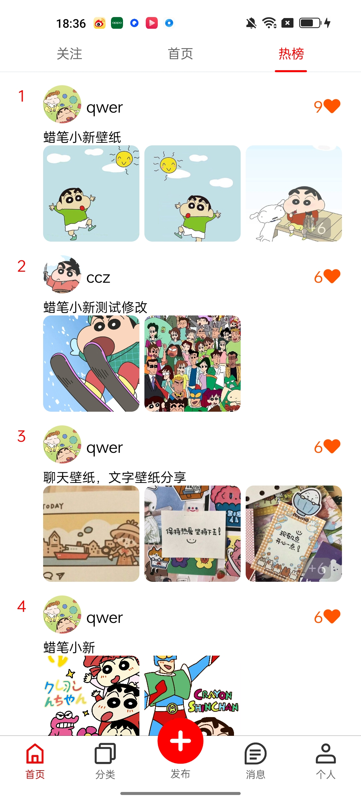
#### 关注页面
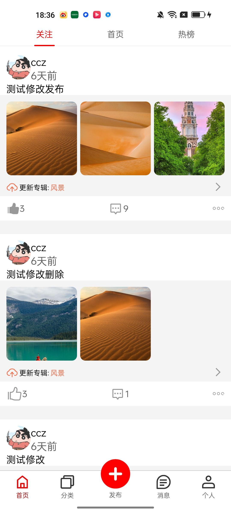
#### 显示页面
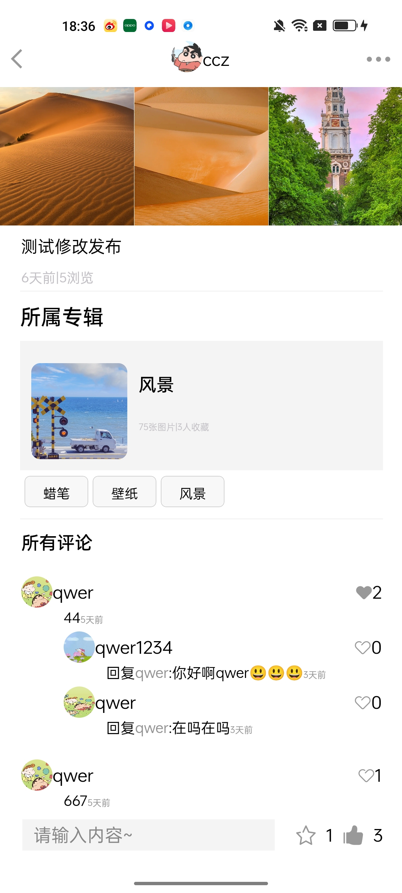
#### 编辑信息

#### 分类页面
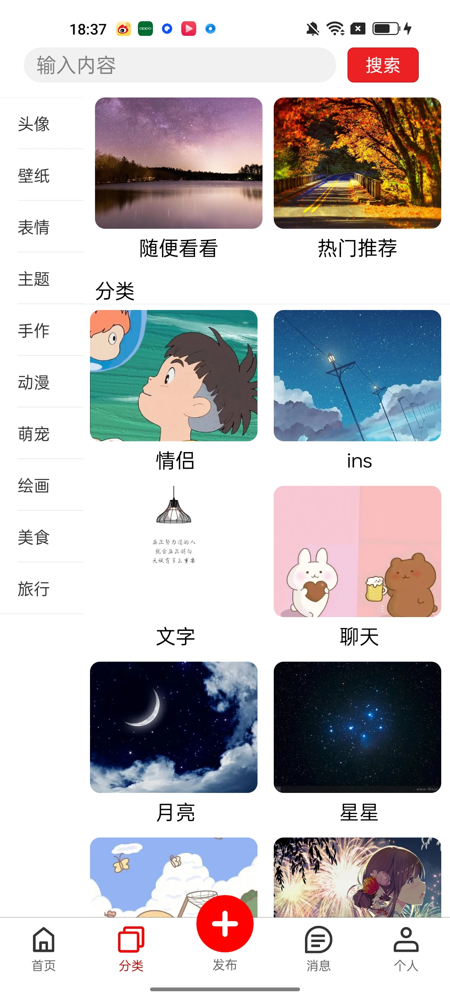
#### 消息页面
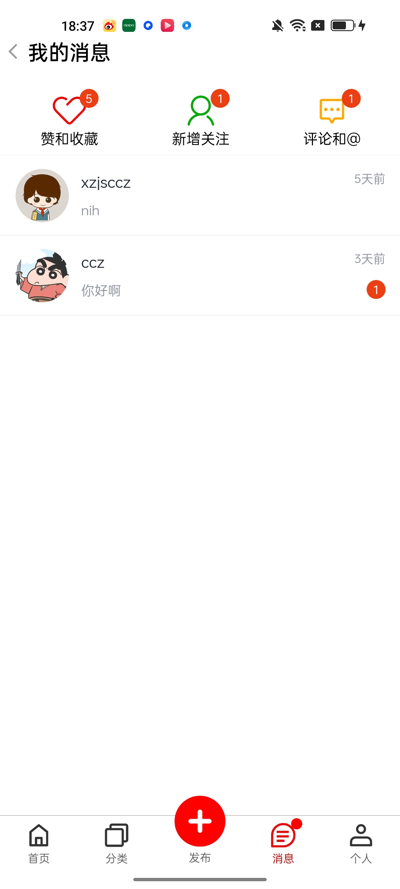
#### 点赞和收藏功能
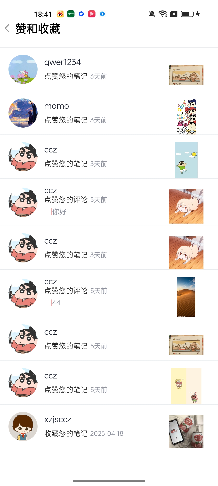
#### 评论和回复页面
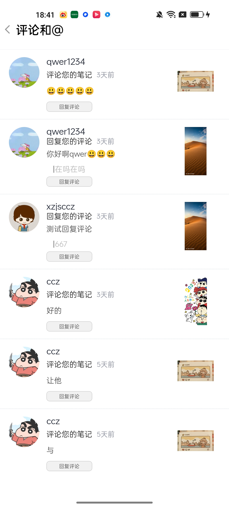

#### 发布页面
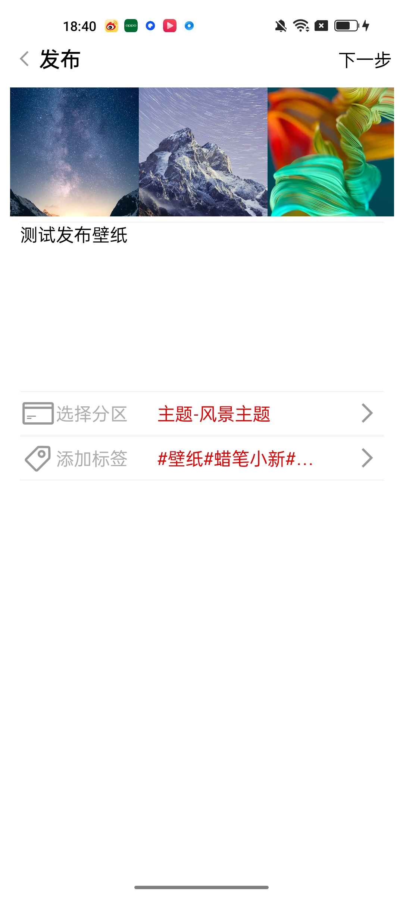
#### 选择专辑

#### 用户信息页面
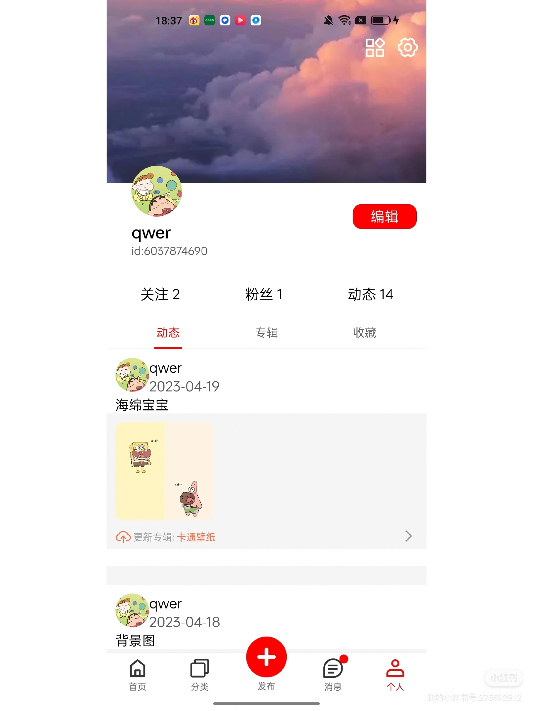

#### 用户发布的专辑
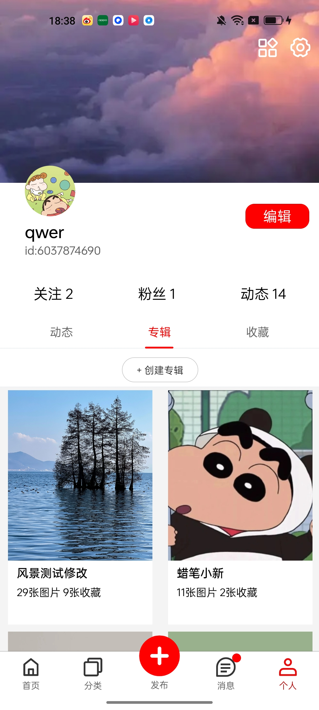

#### 用户的收藏
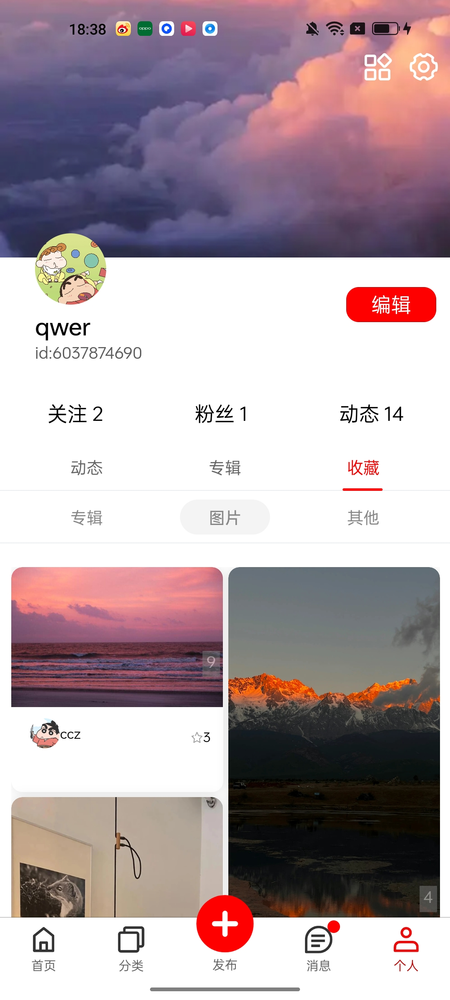

#### 专辑修改
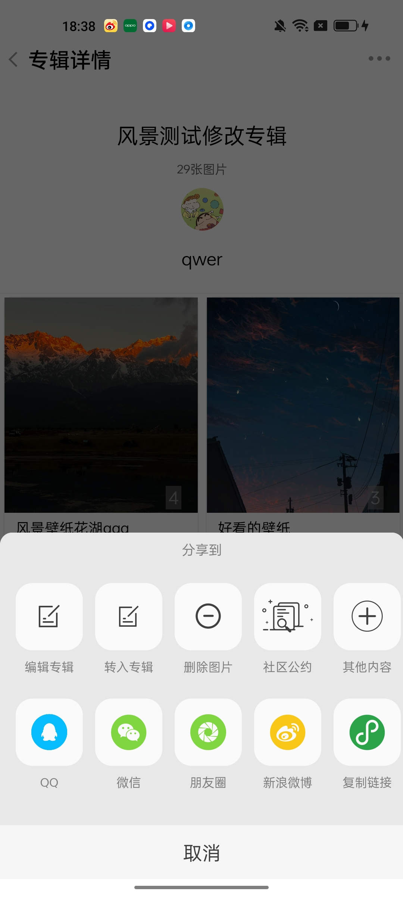

#### 用户信息修改
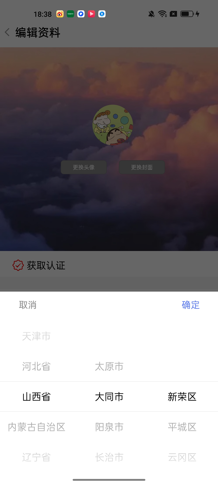

